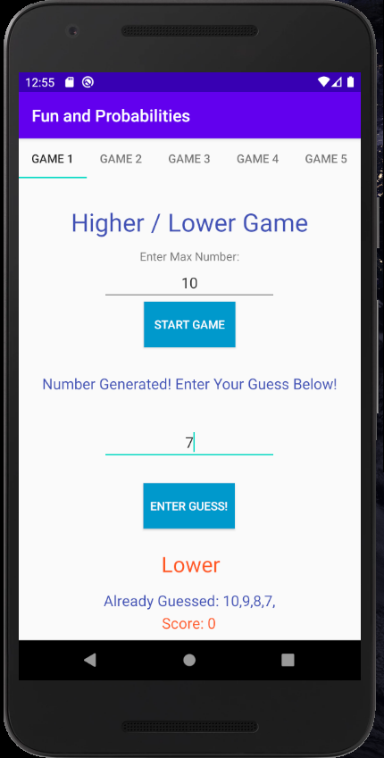
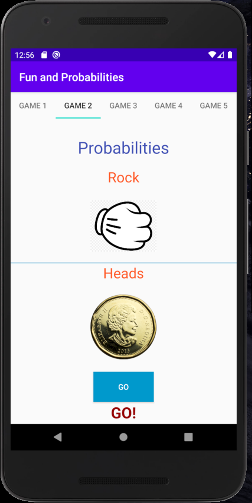
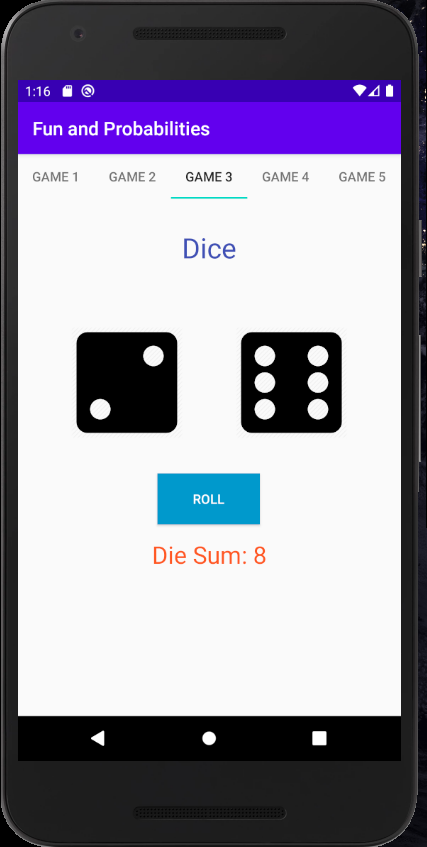
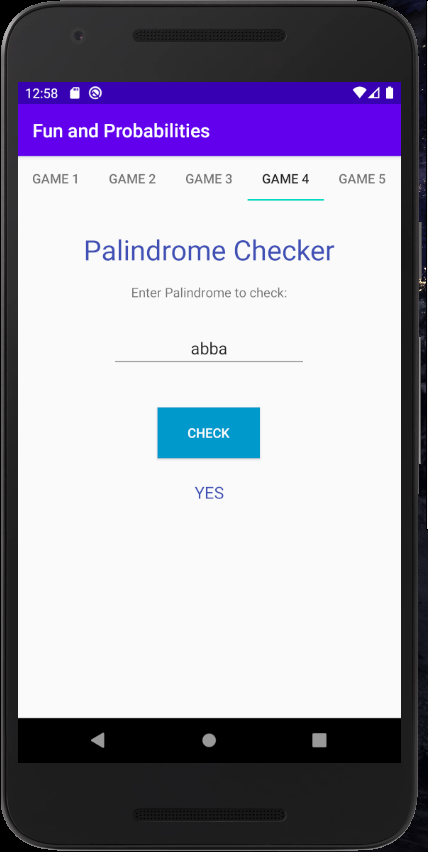
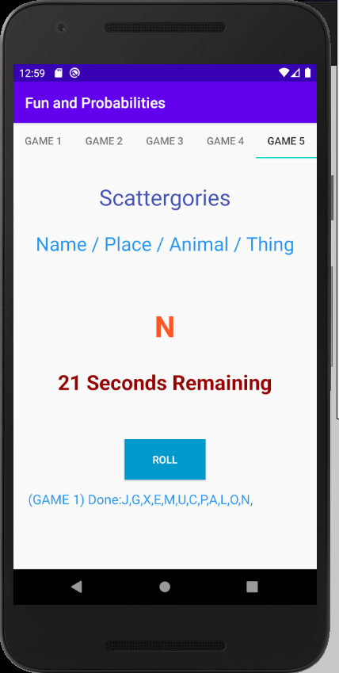

# Fun-And-Probabilities
An android app with 5 tabs. Each tab contains a game or a game that involves some form of probability. 

Game 1 Features:
- A higher or lower guessing game
- User selects the maximum number and then a random number is generated
- The user can input their guess below and will be informed if their guess is higher or lower than the random number or the correct number

Game 2 Features:
- A Rock, Paper, Scissors game with images
- A Coin flip features included as well with images 
- A countdown from 3 (3 seconds total) before displaying the results (so a user can play along)

Game 3 Features:
- A dice rolling generator that rolls the dice randomly and displays the result
- The total of the 2 dies is added together and displayed below as the sum

Game 4 Features:
- A palindrome checker that checks is the string input of a user is in fact a palindrome or not

Game 5 Features:
- A scattergories (Name/Place/Animal/Thing) game manager that generates a random letter each round
- A countdown timer that gives players 30 seconds to record their answers
- Keeps track of letters already displayed in a list and does not display the letter again until all the letters in the alphabet have been displayed 

Project Images:

